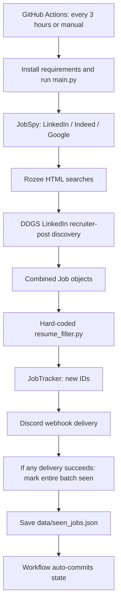

# Job Finder App: project memory and implementation status

**Latest update (2026-09-09):** Scheduled review alerts are enabled at the owner's request, with labeled digests of up to five jobs and the existing shared 20-job run cap. All pending Pyrefly configuration/ignore-comment changes are included. All 75 offline tests and dependency checks pass; Pyrefly reports zero errors with suppressions. The latest inspected production run had 1 already-notified qualified job, 25 review candidates and 310 rejected jobs. Discord destination/message retrieval is verified. See [filtering assessment and review-alert rollout](FILTERING-REVIEW-2026-09-09.md) for exact rule strictness, evidence, and remaining accuracy concerns. The September 8 status below is a historical implementation baseline; published Linux CI and real Discord delivery have since been verified.

**Production incident update (2026-09-08):** Both initial production runs completed discovery/state persistence but were marked failed because partial source warnings triggered exit 2 and the workflow escalated that to exit 1. The operational health policy, Google diagnostic classification and recruiter search handling are corrected. See [production incident analysis](PRODUCTION-INCIDENT-2026-09-08.md) for evidence, fixes and validation. Prior statements of code completion did not establish live-source acceptance.

## Current status — 2026-09-08

The implementation addresses all 24 audit issues at the code level. The original Python/JobSpy/custom-adapter, GitHub Actions, JSON-state and Discord architecture is retained. The user has authorized committing and pushing the complete implementation and documentation to main.

**Validation:** 73 offline tests pass, including a parameterized 54-case matching benchmark; the evaluator agrees with all 54 synthetic expected tiers. Dependency checks and workflow YAML validation pass. Synthetic agreement is regression evidence, not a measured production accuracy percentage.

**Acceptance still outstanding:** live LinkedIn/Indeed/Google verification, live Rozee multi-page verification after observed HTTP 403 blocking, Linux CI execution for the published commit, and a held-out set of manually found good-fit jobs. Optional salary/time-zone preferences remain user decisions. These boundaries must not be described as resolved by offline tests.

## Current application behavior

- A versioned résumé-derived profile distinguishes demonstrated Next.js/React/TypeScript/Node and Python/Django/Flask internships from listed skills and full-time professional experience.
- Matcher 2.1 checks occupation, required technology, contextual experience, education, location, publication/closure and compensation evidence before ranking.
- Independent Karachi and remote searches preserve actual listing work mode. Remote requires Pakistan/worldwide eligibility evidence; missing eligibility or salary disclosure goes to review under the default policy.
- Scrapers preserve identities, complete descriptions, dates and restrictions. Rozee uses bootstrap data and corrected Karachi city ID 1184, with bounded pagination/caches. Explicit recruiter role sections have separate identities and requirements.
- Query budgets, successful watermarks, configurable cadence, per-query yield and source-health reports expose incomplete discovery instead of treating failures as healthy empty results.
- Qualified matches receive individual Discord cards. Review delivery is now enabled for scheduled and ordinary manual runs, using digests of up to five candidates within the shared 20-job run cap.
- Pending jobs survive delivery caps and transient failures. Only confirmed deliveries are acknowledged. Atomic state writes keep previous valid backups; recovery exports a separate candidate for reconciliation.
- Production workflows serialize execution. State-only commits reconcile concurrent acknowledgements, pending retirement and retention pruning while preserving other code changes.
- Saved-run feedback labels jobs by ID and exports capture-time benchmarks without altering delivery history.

## Working references

- [Current issue resolutions](ISSUES.md)
- [Implemented solutions and acceptance boundaries](SOLUTIONS.md)
- [Detailed implementation and validation record](IMPLEMENTATION.md)
- [Run commands, configuration and recovery](../README.md)
- [Candidate profile](../candidate-profile.yaml)

Default delivery remains qualified-only. Optional remote feeds remain disabled for individual pilots. No production workflow was manually dispatched and no Discord test message was sent during implementation. Existing remote job-history updates are preserved when publishing these changes.

The following audit is retained as historical evidence. Its descriptions of defects and original line numbers refer to checkout beec22c, not the current implementation.

## Historical audit baseline (2026-09-07)

- Audit date: 2026-09-07, Asia/Karachi.
- Inspected checkout: `beec22c` (`feat: enforce 1-month freshness on LinkedIn recruiter posts and validate live URLs`). Working tree was clean before this audit.
- Scope: all 22 tracked files, including all 16 Python files, configuration, workflow, README, scratch script, and tracked state; also the locally available, ignored one-page `Resume - Faraz Hussain.pdf`.
- Deliverables: this analysis, [ISSUES.md](ISSUES.md), and [SOLUTIONS.md](SOLUTIONS.md). At the initial audit, application changes were proposals. They were subsequently implemented; the current status above supersedes that baseline.
- Evidence: source inspection, local installed dependency inspection, offline synthetic/mocked checks, PDF text extraction, and primary-source documentation. No production pipeline, Discord notification, live scraping batch, GitHub workflow, commit, or push was executed.
- Local runtime: Python 3.12.10; installed `python-jobspy` 1.1.82, `pandas` 2.3.3, `ddgs` 9.15.0. Workflow requests Python 3.11. The packages installed on the live runner were not inspected.
- All 16 Python files parsed successfully with `ast.parse`. This establishes syntax validity, not correctness or live integration health.

## User objective and constraints

Improve how accurately discovered jobs match Faraz's qualifications, experience, and background, and improve inconsistent discovery. Preserve the existing Python scraping/filtering pipeline, GitHub Actions execution, JSON state, and Discord notifications. Expand sources where useful for remote jobs paying in dollars, while continuing to discover on-site Karachi jobs.

Treat Pakistan-accessible remote work and Karachi on-site work as separate search tracks. A remote label does not establish permission to work from Pakistan, and foreign employers do not establish USD compensation. Local jobs do not inherit the remote USD preference.

Hybrid Karachi work, internships, a minimum salary, acceptable working hours, contract preferences, and interest in stretch roles have not been explicitly confirmed in this conversation. Existing code accepts Karachi hybrid roles and internships; preserve these as configurable options rather than inventing new hard exclusions. Neighborhood priorities exist in code but were not stated by the user or established by the résumé.

## Résumé-derived candidate profile

Source: local `Resume - Faraz Hussain.pdf`, page 1, extracted using the already installed `pypdf`. Contact details are intentionally omitted from these development documents because they are unnecessary for matching.

| Dimension | Evidence | Matching implication |
| --- | --- | --- |
| Education | Bachelor's in Software Engineering, Mohammad Ali Jinnah University, September 2022–July 2026; CGPA 3.7 | Graduate/entry-level software roles; degree dates are not professional experience. |
| Full-stack internship | Tech Venture Solution, on-site, July–September 2025 | Demonstrated Next.js, React.js, TypeScript, Tailwind, Node.js REST APIs, Git, code review, and maintenance work. |
| Python internship | Grow Intern, remote, March–April 2024 | Demonstrated Python, Django, Flask, backend applications, and REST principles. |
| Languages | JavaScript, TypeScript, Python, C#, Java | JS/TS/Python have stronger experience evidence; C#/Java are listed skills, not documented professional specializations. |
| Frontend | React, Next.js, Tailwind CSS, HTML/CSS | Strong frontend/full-stack search families, especially Next.js, currently absent from the matcher. |
| Backend | Node.js, Django, Flask, FastAPI | Node/Django/Flask have internship evidence; FastAPI is listed. |
| Databases | PostgreSQL, MySQL, SQL Server, MongoDB | Useful secondary fit evidence; do not classify a job as suitable just because it says SQL. |
| Tools/cloud | Git, GitHub, AWS, Azure | Listed skills; AWS/Azure do not establish senior infrastructure/DevOps experience. |
| Location | Karachi, Pakistan | Karachi local track; verify country eligibility separately for remote listings. |

The two internships cover approximately five named calendar months in total, with month-level date uncertainty. They do not establish one or two full years of professional experience. The résumé provides no later employment. Use graduate/internship-level fit as the starting point and configurable stretch handling for one-year requirements. Do not count elapsed time since an internship as additional experience.

The current `FARAZ_SKILLS` omits Next.js, AWS, and Azure and adds Express without explicit résumé evidence. More significantly, it mixes actual technologies with generic words such as `web`, `api`, `software engineer`, and `software developer`, treating any single substring as sufficient qualification.

## Architecture actually present



This is a small batch application, not a web application. There is no deployed matching model, vector index, résumé ingestion step, database service, or implemented Telegram notifier. The file `filtering/filter.py` is an older filter that `main.py` does not use.

| Files | Responsibility and audit observation |
| --- | --- |
| `main.py` | Sequential scrape, filter, deduplicate, notify, save. Dry run skips delivery/state saving but still performs network scraping. Most handled failures do not produce a failing process status. |
| `config.py`, `config.yaml` | YAML plus defaults; only Discord secret comes from the environment. Nested defaults are replaced by shallow merge. Active résumé rules ignore `config`. |
| `scrapers/base.py` | Shared `Job` dataclass and synthetic hash; lacks compensation, eligibility, confidence, structured requirements, and source-native ID handling. `to_dict()` truncates description to 200 characters and is not used by the current pipeline. |
| `scrapers/jobspy_adapter.py` | Converts DataFrame rows into jobs. Discards useful JobSpy fields and infers remote status from query/title/location. LinkedIn description fetching is not enabled. |
| `scrapers/rozee_scraper.py` | Two first-page HTML searches per keyword; extracts titles/companies/URLs but invents location/date labels and leaves descriptions empty. |
| `scrapers/linkedin_posts_scraper.py` | Five fixed DDGS queries, up to six results each; search snippets become jobs. Accessibility and recency checks are weak. |
| `filtering/resume_filter.py` | Substring exclusions, broad role tokens, regex experience check, permissive geography, and any-one-skill acceptance. No numerical ranking. |
| `filtering/filter.py` | Unused configurable title filter; misleading maintenance path if mistaken for active code. |
| `notifiers/manager.py`, `notifiers/discord.py` | Discord-only dispatch; aggregate boolean loses individual delivery outcomes. Retry response is not checked. |
| `storage/tracker.py`, `data/seen_jobs.json` | Hash-to-notification-time state, 30-day retention; no listing snapshots or outcome history. |
| `.github/workflows/job_finder.yml` | `17 */3 * * *` UTC, manual dispatch, Python 3.11, dependency install, pipeline, state auto-commit. No concurrency group, explicit runtime budget, test step, or audit artifacts. |
| `requirements.txt` | All six direct dependencies have minimum-only version constraints. |
| `scratch/test_search.py` | Network experiment executing DDGS searches at import time; no assertions and no regression suite. |
| `README.md`, `.gitignore`, package initializers | README overstates enabled sources/Telegram and documents inactive filter settings. PDF is ignored. Initializers have no substantive application behavior. |

Current configured workload is 13 keywords × 2 locations × 3 JobSpy sites = **78 JobSpy calls per run**, plus **26 Rozee search-page requests**, **5 DDGS searches**, and up to **30 post-accessibility requests** before notifications. JobSpy and DDGS can make additional internal requests. At eight scheduled runs per day this implies 624 JobSpy calls and 208 Rozee search-page requests before those internal requests; these are planned counts, not measured successful traffic.

`results_wanted=15` applies per JobSpy call before filtering and deduplication. The theoretical requested total is 1,170 rows, not 1,170 distinct jobs. Queries overlap heavily, early results can be unsuitable, and there is no application-level pagination/offset strategy or incremental search watermark. Each nominal remote query is also anchored to Karachi.

## Main diagnosis

The reported mismatch has several demonstrated causes that reinforce each other:

1. **Discovery coverage is constrained.** Broad overlapping queries retrieve small top slices, important résumé-aligned search variants are missing, and remote searches are geographically narrowed.
2. **Evidence is lost before matching.** LinkedIn descriptions are not fetched under the inspected JobSpy defaults; Rozee descriptions are always empty. Query intent replaces actual job location and remote status.
3. **Qualification rules are internally inconsistent.** Generic role words can pass unrelated stacks, substring collisions reject good roles, and incidental words can bypass experience requirements.
4. **Geographic and salary requirements are not enforced.** Country-only on-site listings and restricted-country remote jobs can pass. USD pay cannot be assessed using the present model.
5. **Delivery failures can hide good matches.** Partial Discord success marks failed jobs as notified; some unsuccessful retries are counted as successful.
6. **The system cannot explain its performance.** There is no labeled benchmark, source health classification, saved decision evidence, or per-stage funnel report.

These establish credible mechanisms for both poor alerts and missed opportunities. They do **not** quantify how much each contributes in production. No current run logs, manually found listing examples, or historical scraped descriptions were available in this checkout.

## Controlled matching checks

All examples below are synthetic; they describe observed execution of the current filter, not real vacancies. Default fixture company/platform were `Fixture`, default URL was `https://example.test/jobs/1`, and default location was `Karachi, Pakistan`. Unless specified, `is_remote=False`.

| Input title / description / exception to default location | Observed | Interpretation |
| --- | --- | --- |
| `Software Engineer` / `Must have Ruby on Rails expertise.` | Accept | Generic title itself satisfies a skill match; missing mandatory stack is ignored. |
| `Software Engineer` / empty description | Accept | Title-only evidence is presented as qualified. |
| `Next.js Developer` / `Next.js required.` | Reject | Candidate's prominent framework is missing from skills. |
| `Software Developer` / `Requires 5 years experience. Must be a university graduate.` | Accept | `graduate` bypasses the requirement. |
| `Software Developer` / `Requires 5 years experience at an international company.` | Accept | `intern` matches inside `international`. |
| `Junior Python Developer` / `A 4 year degree is required. No experience required.` | Reject | Degree duration is interpreted as experience. |
| `Python Developer` / `1 to 3 years experience required.` | Reject; parser returns `[3, 1]` | Upper bound is captured separately as a minimum; unsuitable for a configurable one-year stretch policy. |
| `Python Developer` / `Python` / `Hyderabad, Pakistan` | Accept | Unlisted non-Karachi city passes. |
| Same with location `Pakistan` | Accept | Country does not establish city. |
| `Python Developer` / `Python. Remote, US residents only.` / `United States`, remote true | Accept | Pakistan eligibility is unchecked. |
| `Python Developer` / `Python. Work from home is not permitted.` / `Lahore, Pakistan` | Accept | Negated remote phrase bypasses city rejection. |
| `Software Developer - Academy` / `Python React` | Reject | `cad` matches inside `Academy`. |
| `Software Engineer - Sales Platform` / `Python React` | Reject | Product domain is mistaken for an unrelated occupation. |
| `Civil Engineer` / `Join a rapidly growing company.` | Accept | Broad `engineer` token plus `api` inside `rapidly`. |
| `Python Developer` / `Minimum five years of experience required.` | Accept | Written number is not parsed. |
| `Junior Full Stack Developer` / `React, TypeScript, Next.js, Node.js. 0-1 years experience.` | Accept | Positive control aligned with the résumé. |

Minimal local reproduction pattern, run from repository root; it performs no network calls:

```python
from scrapers.base import Job
from filtering.resume_filter import filter_jobs_for_faraz

def accepted(title, description, location="Karachi, Pakistan", remote=False):
    job = Job(title, "Fixture", location, "https://example.test/jobs/1",
              "Fixture", description=description, is_remote=remote)
    return bool(filter_jobs_for_faraz([job], {}))

print(accepted("Next.js Developer", "Next.js required."))  # False
print(accepted("Software Engineer", "Must have Ruby on Rails expertise."))  # True
print(accepted("Software Developer",
               "Requires 5 years experience. Must be a university graduate."))  # True
```

## Controlled adapter, delivery, and state checks

HTTP and JobSpy calls in these checks were mocked. State delivery checks used a temporary JSON file; the tracked state was not modified.

| Check | Observed result |
| --- | --- |
| Remote-query JobSpy row explicitly says `is_remote=False`, Lahore, on-site only | Adapter returns `is_remote=True`; captured call uses Karachi, `hours_old=72`, and `is_remote=True`. |
| Local-query JobSpy row explicitly says `is_remote=True`, United States, with no remote keyword | Adapter returns `is_remote=False`. |
| DataFrame company/location/date contain floating-point NaN | All three become literal string `nan`. |
| First DataFrame row contains `pd.NA` company; second row is valid | Conversion raises ambiguous-boolean error inside query-level handler; zero rows returned and later valid row skipped. |
| Two Discord jobs: HTTP 204 then HTTP 500; caller applies current `if sent` behavior | Batch returns true; both IDs are saved as seen. |
| One Discord job: HTTP 429 then HTTP 500 | `send_jobs` returns true. |
| LinkedIn post accessibility check receives HTTP 403 | Returns active/recent true. |
| Current hiring snippet mentions `2025 graduates welcome` | Rejected as stale before an accessibility check. |
| Same job URL with two different `utm_source` values | Two different job IDs. |
| Rozee mocked card includes Lahore, five-year requirement, and old date | Two queries produce Karachi/Pakistan labels, empty descriptions, and `Recently`; both records pass filtering before deduplication. |
| `Job(description=None)` passed to active filter | `AttributeError` in location check, despite the dataclass allowing an optional description. |

Reproduction of the incorrect retry success without sending any message:

```python
from types import SimpleNamespace
from unittest.mock import patch
from scrapers.base import Job
from notifiers.discord import DiscordNotifier

job = Job("Python Developer", "Fixture", "Karachi", "https://example.test/1",
          "Fixture", description="Python")
limited = SimpleNamespace(status_code=429, json=lambda: {"retry_after": 0})
failed = SimpleNamespace(status_code=500, text="fixture error")
with patch("notifiers.discord.requests.post", side_effect=[limited, failed]), \
     patch("notifiers.discord.time.sleep"):
    print(DiscordNotifier("https://example.test/webhook").send_jobs([job]))  # True
```

## State and production-evidence limits

The checked-in state has 28 IDs, with timestamps from 2026-07-27 19:59:13 UTC to 2026-08-17 17:50:03 UTC. The file stores no title, source, decision, publication date, or individual delivery response. Therefore it cannot demonstrate match accuracy, source availability, the number of missed jobs, or even that every ID was delivered successfully. Older entries are pruned on load after 30 days; loading alone does not persist pruning.

The latest local commit/state dates do not prove that production stopped on August 17. Remote repository state and Actions history were not fetched. Blocking by job boards, changed Rozee markup, geographic effects of runner egress, search indexing delay, and schedule delays are plausible contributors requiring live evidence; they were not established as current incidents.

## Decisions for follow-on work

- Follow the prioritized, issue-linked stages in [SOLUTIONS.md](SOLUTIONS.md); use [ISSUES.md](ISSUES.md) as the defect register.
- First protect delivery acknowledgements and capture evidence; then normalize data and repair matching, before increasing source volume.
- Represent missing information as unknown. Separate fit from evidence confidence and remote eligibility.
- Use a versioned, résumé-derived structured profile; re-reading a PDF on every scheduled run is unnecessary.
- Preserve the existing architecture. Additional modules, adapters, YAML settings, and versioned JSON records are sufficient for the proposed work.
- Use reproducible fixtures and saved run artifacts to validate improvement against manually found jobs; do not claim an accuracy percentage before measurement.
- Start expansion with documented remote feeds/APIs and selected employer boards after the core fixes. Their existence does not guarantee eligible junior jobs or USD pay.
- When implementing, update these documents with resolved issue IDs, validation evidence, profile changes, and remaining uncertainties. Retain this audit baseline so future behavior is not confused with the original defects.

## External verification

Primary references were checked on the audit date; exact locally inspected behavior remains version-specific. JobSpy documents optional LinkedIn detail fetching and incompatible Indeed filter groups. Its Google README wording is broader than the installed implementation: local version 1.1.82 builds a fallback query when `google_search_term` is absent, so absence alone is not a proven Google failure. See [JobSpy documentation](https://github.com/speedyapply/JobSpy).

Provider expansion constraints and Discord/GitHub API details are cited alongside the relevant proposals in [SOLUTIONS.md](SOLUTIONS.md). No claim is made that proposed new integrations have been tested live.


## Implementation continuation — 2026-09-08

The [implementation record](IMPLEMENTATION.md) is the current engineering status. Pagination/caching, source cadence/yield, independent recruiter roles, review digests, relevance feedback, validated backup export and concurrent Git state reconciliation are implemented within the original architecture.

Additional findings: Rozee bootstrap descriptions contain HTML; duplicate results on one query must not stop another query's later pages; merging acknowledgements must preserve intentional retention pruning when the remote value is unchanged. These now have corrections and regression coverage. Production accuracy still requires manually found good-fit examples and current source validation.
